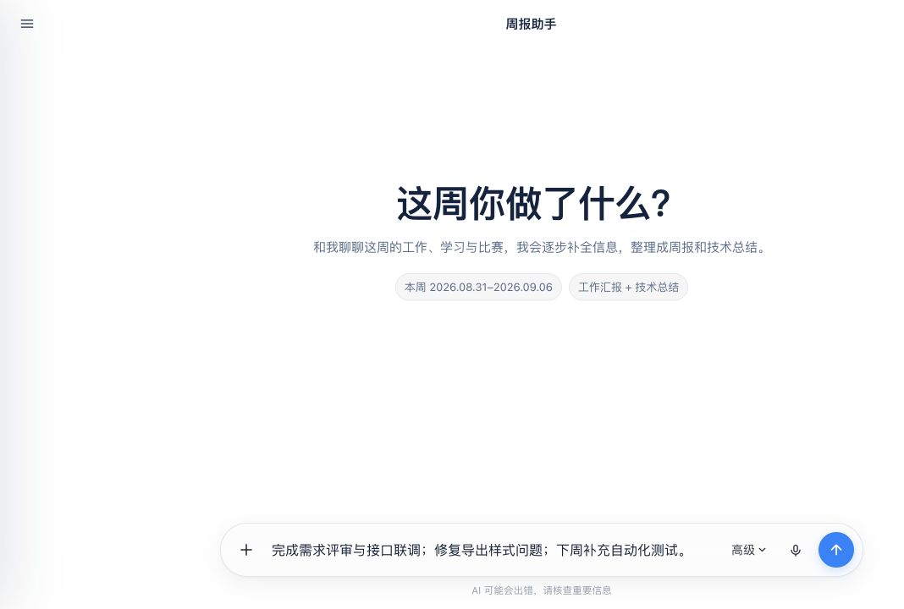

# yixiongli

全栈开发者，关注 AI 创作工具、Web 应用与交互体验。 
太原理工大学 · 计算机科学与技术

## 作品

### Create-World-skills

将游戏创作方法沉淀为可复用的 AI Skills。

[仓库](https://github.com/liiiyiiixiii/Create-World-skills)

预览

### 高墙之外

可在浏览器体验的 2D 像素剧情冒险游戏。

[在线试玩](https://www.liyixiong.cn/game/) · [仓库](https://github.com/SSxs-wym/Beyond-The-Walls-)

预览

### Weeknote

将零散记录整理为可编辑、可导出 Word 周报的 AI 应用。

[仓库](https://github.com/liiiyiiixiii/weeknote)

预览

---

更多背景

- 计算机科学与技术卓越工程师班
- TYUT 计算菁英计划
- SKIIS（工业互联网安全山西省重点实验室）本科科研成员
- TYUT AI 漫剧工作室成员

技术栈

- **语言与基础**：Python · Go · TypeScript · JavaScript · Git · Linux
- **AI 与后端**：FastAPI · LangChain · NumPy
- **前端与创意**：React · Next.js · Vue · Three.js · WebGL · GSAP · Tailwind CSS · Vite
- **数据与部署**：PostgreSQL · MySQL · SQLite · MinIO · Docker · GitHub Actions

[个人网站](https://liyixiong.cn/profile) · [邮箱](mailto:liyixiong2022@163.com)
